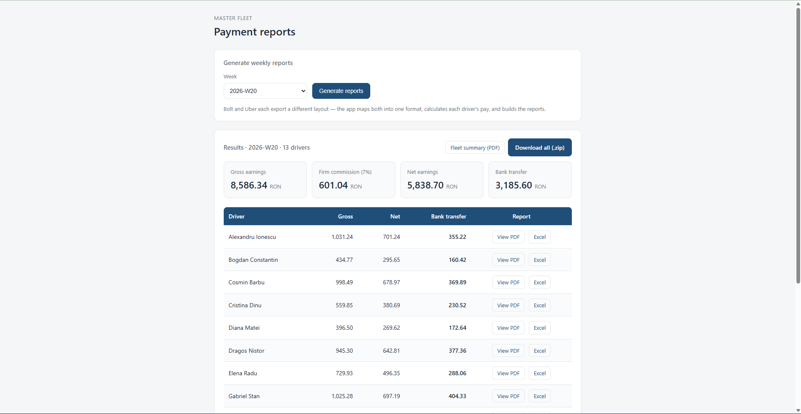

# Fleet Payment Report Generator

A small web app — and the Python pipeline behind it — that turns the weekly driver data
exported by **Uber** and **Bolt** into per-driver payment reports: a PDF payment slip and
an Excel file for each driver, plus a fleet-wide summary. Built as a portfolio project,
modelled on a real ride-hailing fleet I drove for, where the owner receives raw exports
from each platform and has to produce a payment report for every driver.

**Live demo:** https://fleetreports.pythonanywhere.com/



The interesting part: the two platforms export data in **different shapes** (different
column names and structure). The app normalises both into one common format, applies the
fleet's payment rules, and generates the reports.

## What it does

1. **Reads** the weekly exports from both platforms (`uber.csv`, `bolt.csv`).
2. **Normalises** the two different layouts into one common schema (a small ETL step).
3. **Calculates**, per driver: platform commission, the fleet's own 7% commission, net
   earnings, and the final bank transfer (net + tips + bonus − cash the driver already kept).
4. **Generates** a PDF payment slip and an Excel file per driver, plus a fleet summary —
   an Excel workbook (with a per-platform breakdown sheet and a bank-transfer chart) and a
   one-page PDF. Derived values in the Excel files are written as live **formulas**, so the
   math is transparent and the files recalculate.

## How it works

The platforms don't agree on column names — Bolt says `Bolt commission`, Uber says
`Uber service fee`; Bolt has `Bonus`, Uber has `Promotions`; and so on. `fleet_logic.py`
maps each export into a single internal table:

```
driver | platform | gross | platform_commission | cash | tips | bonus
```

Drivers can be on one platform or both — the tool combines a driver's rows across platforms
(and handles drivers who only drove for one of them). `generate_reports.py` then writes the
Excel files and `pdf_report.py` builds the PDFs.

## Driver payment slip (PDF)


## Fleet summary (PDF)


## Web app

Pick a week and generate the reports; the page shows the fleet totals and a per-driver
table, where each driver's payment slip opens as a **PDF** in the browser, with the Excel
file downloadable too (or everything together as a zip). Try it on the
[live demo](https://fleetreports.pythonanywhere.com/), or run it locally:

```bash
pip install -r requirements.txt
python app.py
# open http://127.0.0.1:5000
```

## Command line

The reports can also be generated from the command line. Requires Python 3.10+.

```bash
# (recommended) virtual environment
python -m venv .venv
source .venv/bin/activate        # Windows: .venv\Scripts\activate
pip install -r requirements.txt

# generate the reports for one period
python generate_reports.py 2026-W10

# or generate every period found under data/
python generate_reports.py --all
```

The reports appear under `reports/<year>/<week>/` — a PDF and an Excel per driver plus the
fleet summary. Sample data is included for many weeks (2025-W40 → 2026-W20), so it runs out
of the box.

To create fresh synthetic input data:

```bash
python generate_sample_data.py            # regenerate all sample weeks
python generate_sample_data.py 2026-W05   # a single week
```

## Project structure

```
.
├── app.py                    # Flask web interface (pick a week, view PDF, download Excel)
├── generate_reports.py       # builds the Excel reports (formatting, formulas, chart)
├── pdf_report.py             # builds the PDF reports (reportlab) for in-browser viewing
├── fleet_logic.py            # reads & normalises the two platform exports (pandas)
├── generate_sample_data.py   # makes synthetic Bolt/Uber exports for testing
├── templates/index.html      # the web page
├── requirements.txt
├── data/                     # raw weekly exports, archived per period
│   ├── 2025/
│   │   └── W40/ ... W52/
│   │       ├── bolt.csv
│   │       └── uber.csv
│   └── 2026/
│       └── W01/ ... W20/
└── reports/                  # generated reports (reports/<year>/<week>/)
```

Inputs are organised by period and kept rather than overwritten, so there's a traceable
history of every week's data — the way a real fleet would need it for accounting.

## Notes

All drivers and figures are fictional. The payment rules (platform commission, the fleet's
7% commission, cash reconciliation) are modelled on a real weekly fleet report.

## Roadmap

- Optional email step: prepare each driver's email with a payment summary.
- Support for additional platforms.

## Author

**Florin-Traian Zadorojneac** — Automation & Applied Informatics student, Galați, Romania.
